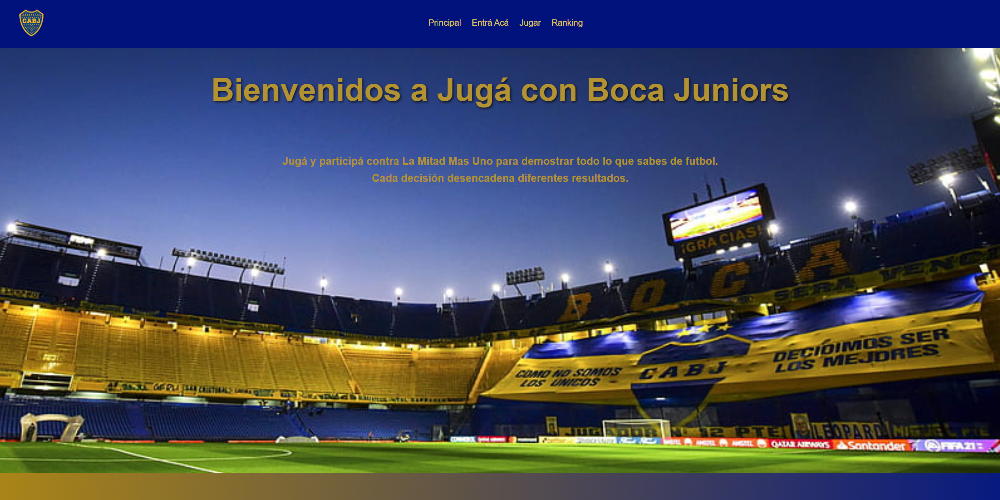
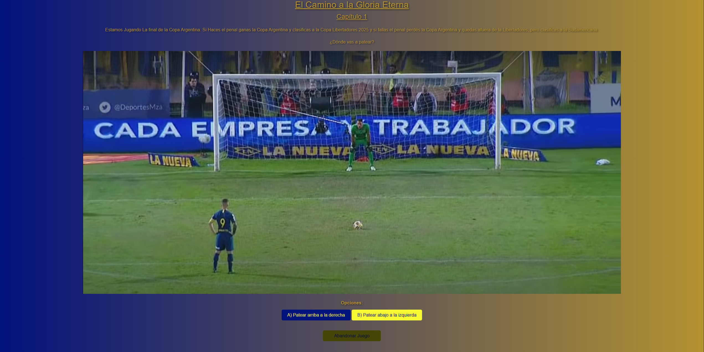
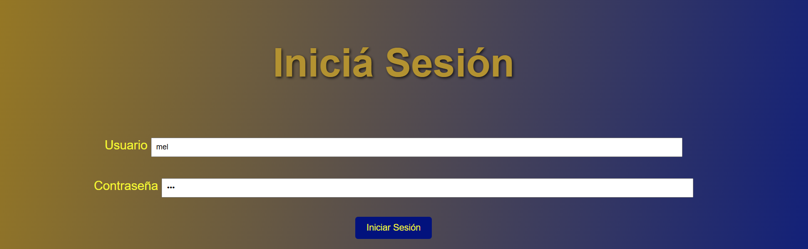
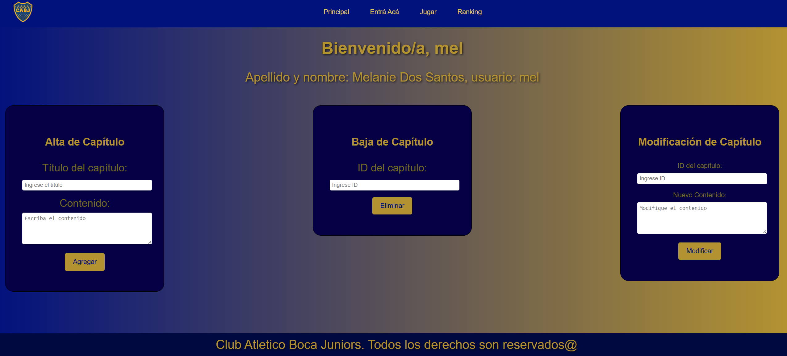

# Interactive Page - Proyecto Educativo

Esta es una página web interactiva desarrollada como parte de mi formación para la materia Lenguaje de Marcado. El proyecto explora la navegación dinámica y la gestión de estados a través de diferentes capítulos lúdicos, donde cada decisión lleva a un final diferente.

## 🚀 Tecnologías Utilizadas
* **HTML5:** Estructura semántica de los diferentes capítulos.
* **CSS:** Diseño responsivo y estilos visuales.
* **JavaScript:** Gestión de eventos para validación de acceso de administrador y manejo de parámetros de URL para personalización de la interfaz.

## 📌 Características
* Narrativa ramificada según las decisiones del usuario.
* Panel de administración (`admin.html`) simulando una gestión interna.
* Organización de recursos multimedia para optimización de carga.

## 🔗 Demo en vivo
Podés ver el proyecto funcionando aquí: https://695459ca1e9971d41e564635--exquisite-yeot-d6b028.netlify.app/

## 🖼️ Galería del Proyecto

### 🏠 Vista Principal (Home)
Página de inicio con la presentación.

### 📖 Experiencia Interactiva (Capítulo 1)
Interfaz de la narrativa donde el usuario comienza su recorrido.

### 🔐 Sistema de Acceso (Admin)
Validación de credenciales y panel personalizado.

  
  

